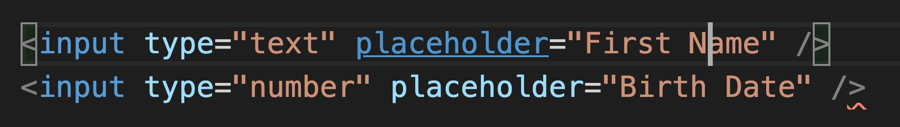

  

<h1>Learning Objectives</h1>
<ul>
  <li>Understand the purpose of HTML</li>
  <li>How to structure a document</li>
  <li>Hierarchy In HTML</li>
  <li></li>
</ul>

<h1>Key Terms</h1>
<ul>
  <li>Element</li>
  <li>Tag</li>
  <li>Attribute</li>
</ul>

<h1>What is HTML?</h1>

Hyper Text Mark-up Language, used to describe the content and structure of a web page. Think of HTML as the foundation to a web page, it is what holds everything together it where you connect the css files, javascript files and anything else that you need in order to make the web page work.

 

  

 

This is what a typical Element looks like

 

  

  

  

