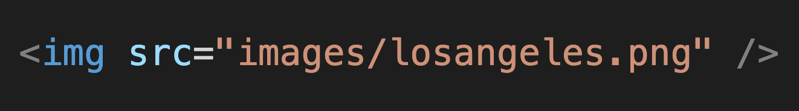

  

<h1>Learning Objectives</h1>
<ul>
  <li>Understand the purpose of HTML</li>
  <li>How to structure a document</li>
  <li>Attribues</li>
  <li></li>
</ul>

<h1>Key Terms</h1>
<ul>
  <li>Element</li>
  <li>Tag</li>
  <li>Attribute</li>
</ul>

<h1>What is HTML?</h1>

Hyper Text Mark-up Language. HTML is used to describe the content and structure of a web page. Think of HTML as the foundation to a web page, it is what holds everything together. It is where you connect the css files, javascript files and anything else that you need in order to make the web page work.

 

  

 

<h1>Elements and Tags</h1>

A Element is a component of the document. Elements are a tree of nodes that make up the document of what we see.

Tags are what make up these element. Most elements have closing tags and opening tags.

 

a typical element with opening and closing tags

  

 

a typical element with only a opening tag

  

 

<h1>Attributes</h1>

This tag also includes an attribute. The input requires an attribute that tells the element what type of input it is. Attributes provide further additional instructions and always take the form of key="value". Certain attributes only have use for specific tags.

  

<h1>More commonly used elements</h1>

  

